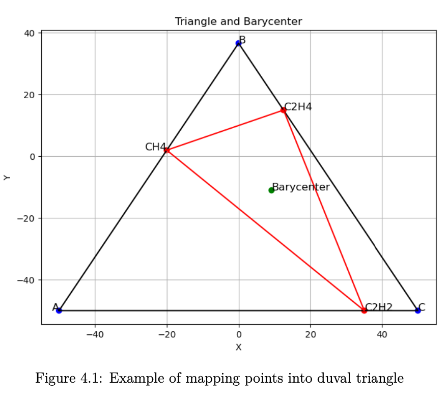
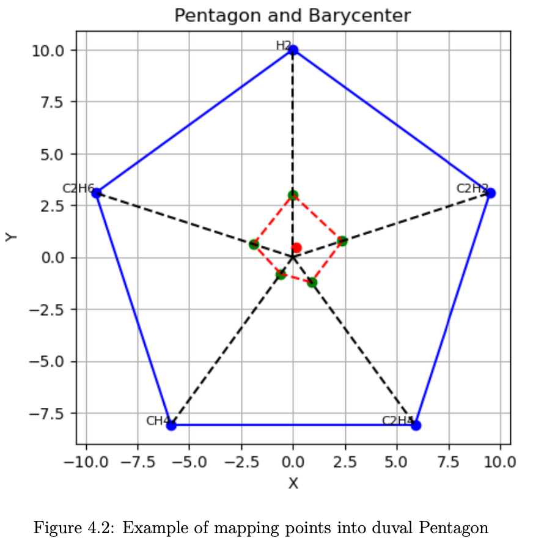
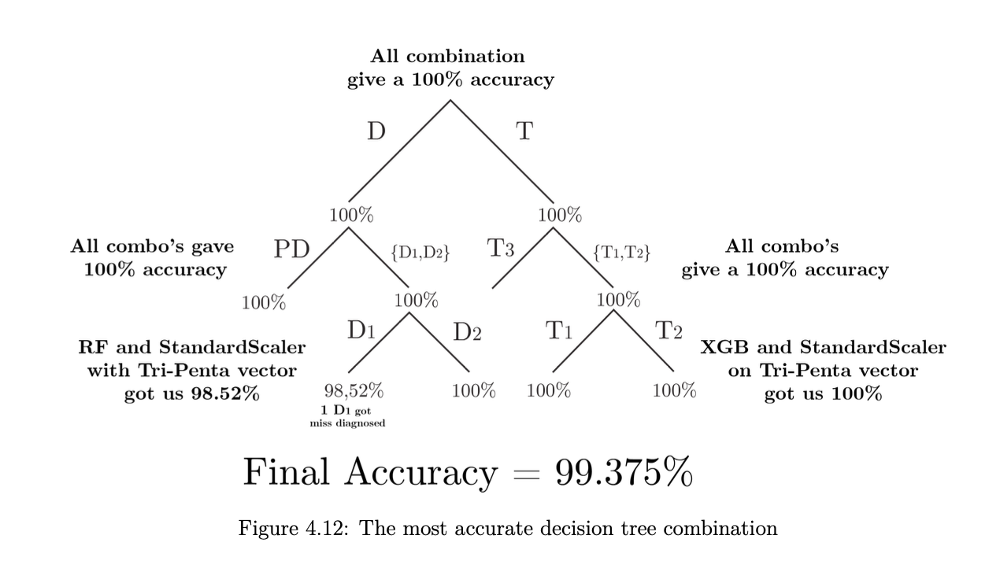

# Machine Learning for Diagnosing Power Transformers

## Overview
This repository contains code and resources for my master's thesis project, which focuses on diagnosing the condition of power transformer oil using Dissolved Gas Analysis (DGA). The analysis was conducted using several machine learning algorithms to classify faults in transformers based on the concentration of gases like **H₂, CH₄, C₂H₂, C₂H₄, and C₂H₆**.

We implemented various machine learning models including **Support Vector Machines (SVM)**, **Random Forest**, and **XGBoost**, while also employing different data pre-processing techniques to enhance performance. Ultimately, we developed a **custom decision tree**, achieving a **99.375% diagnostic accuracy** on the test dataset.

## Dataset
The dataset used for this project consists of **666 samples** of DGA data, split as follows:
- **506 samples** for training
- **160 samples** for testing

The dataset was analyzed for six types of electrical and thermal faults based on **international standards** such as IEC and IEEE. The six fault types considered are:
- **PD** (Partial Discharge)
- **D1** (Discharges of Low Energy)
- **D2** (Discharges of High Energy)
- **T1** (Thermal Faults < 300°C)
- **T2** (Thermal Faults 300°C - 700°C)
- **T3** (Thermal Faults > 700°C)

## DGA Input Vectors
Eight input vectors were considered, based on methodologies from Kherif et al. (2021) [21]:

- **Vector 1**: Raw concentrations of the five gases: [H₂, CH₄, C₂H₂, C₂H₄, C₂H₆].
- **Vector 2**: IEC Ratios method using three gas ratios: [CH₄/H₂, C₂H₂/CH₄, C₂H₄/C₂H₆].
- **Vector 3**: Roger’s four-ratio method: [CH₄/H₂, C₂H₂/C₂H₄, etc.].
- **Vector 4**: Dornenburg’s four gas ratios in ppm: [C₂H₂/C₂H₄, CH₄/H₂, etc.].
- **Vector 5**: Duval Triangle method: [Cx, Cy] computed from three gases.

- **Vector 6**: Duval Pentagon method: [Cpx, Cpy] using all five gases.

- **Vector 7**: Combination of Roger’s and Dornenburg’s ratios (five ratios).
- **Vector 8**: Combination of Duval Triangle and Pentagon methods: [Cx, Cy, Cpx, Cpy].

## Machine Learning Models
This repository includes notebooks for the implementation of several machine learning models:
- **Support Vector Machines (SVM)**
- **Random Forest**
- **XGBoost**

Each method is evaluated and enhanced using various pre-processing techniques and parameter tuning. Comparative analysis of the models can also be found in the notebooks.

## Custom Decision Tree
To further improve the diagnostic accuracy, we built a **custom decision tree** tailored to this specific problem. This model outperformed the others, achieving a **99.375% accuracy** on the test dataset.

## Repository Contents
- **Data Preprocessing**: Steps to create the eight input vectors from the raw DGA data.
- **ML Models**: Implementation of SVM, Random Forest, and XGBoost models, along with performance enhancements.
- **Custom Decision Tree**: The custom-built decision tree model, which provides the highest diagnostic accuracy.

